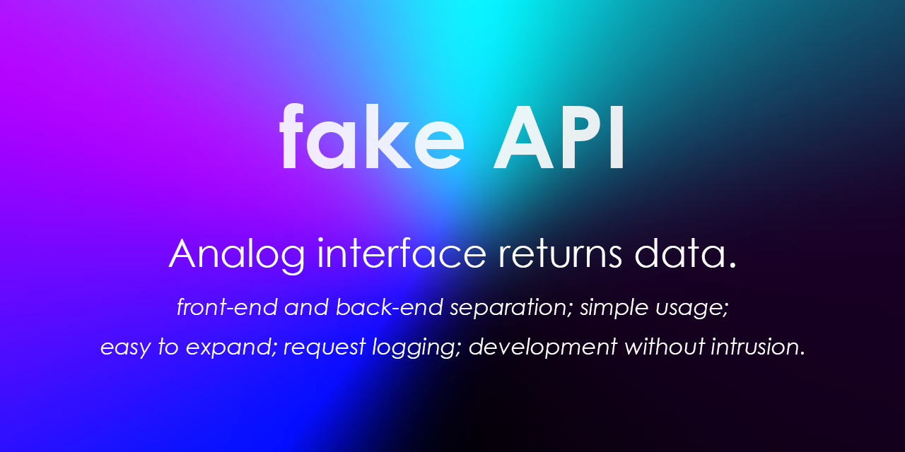

*模拟接口返回数据*

### 前后端分离

可以让前端独立于后端进行开发

### 用法简单

符合直觉；使用前端开发皆有的nodejs环境

### 方便扩展 

可根据调用接口时的传参进行不用数据的返回

### 请求记录 

保存请求的记录，便于回溯

### *开发无侵入

对于使用脚手架所进行的前端开发，仅需改变baseUrl即可

### 使用步骤 

1. `npm install`
2. 使用 `config-template.js` 模板文件创建 `config.js` 
3. `npm start`
4. 直接访问接口url（http://localhost:xxxx/xxxxxxxx/xxx）
5. 在已配置的文件夹下自动生成的文件中填写返回数据
6. 再次访问url,获得返回数据

------

###  front-end and back-end separation

Allows the front-end to develop independently of the back-end.

### simple usage

Intuitive; uses a nodejs environment that is common to all front-end developers.

### easy to expand

Returns unused data according to the parameters passed when calling the interface.

### request logging

Keep a record of requests for easy backtracking.

### *development without intrusion

For front-end development using scaffolding, you can simply change the baseUrl.

### Usage steps

1. `npm install`
2. Create `config.js` using `config-template.js` template file.
3. `npm start`
4. Direct access to the interface url（http://localhost:xxxx/xxxxxxxx/xxx）.
5. Fill in the return data in the automatically generated file under the configured folder.
6. Re-visit the url to get the returned data.
